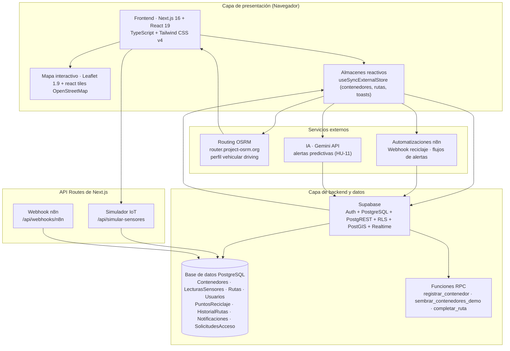
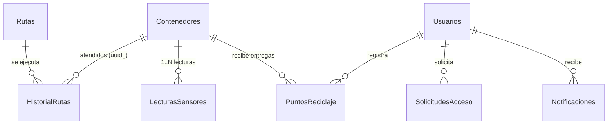

# Informe del Proyecto — EcoRoute AI

**Sistema Web de Optimización Dinámica de Rutas para la Recolección Eficiente de Residuos Sólidos Municipales**

| Campo | Detalle |
| --- | --- |
| **Institución** | Universidad Nacional Experimental de Guayana (UNEG) |
| **Asignatura** | Técnicas de Programación III / Ingeniería de Software I |
| **Sección / Lapso** | Sección 1 — Lapso CIVA 2026 |
| **Autor** | Fabiola García (C.I.: 28.694.007) |
| **Profesora** | Ing. Dubraska Roca |
| **Metodología** | SCRUM adaptada a 4 Sprints |
| **Repositorio** | https://github.com/anastasiagarcs-afk/ecoroute-ai |

> **Documento editable**: este informe es el documento académico formal del proyecto. Algunas secciones contienen *placeholders* marcados con **✏️ A REEMPLAZAR** que deben completarse con capturas, enlaces y prompts reales antes de la entrega final.

---

## a. Proceso de Elicitación de Requisitos

La elicitación de requisitos es la actividad mediante la cual se identifica, comprende y documenta lo que el sistema debe hacer. Para EcoRoute AI se aplicó el **enfoque iterativo de Roger Pressman**, compuesto por **5 fases**, adaptadas al contexto de un sistema municipal de gestión de residuos sólidos.

### Fase 1 — Reconocimiento del problema

Se partió del análisis del dominio: los **camiones compactadores municipales** realizan recorridos programados sin conocer el estado real (nivel de llenado) de los contenedores. Esto genera:

- **Falta de visibilidad en tiempo real** del estado de contenedores, rutas y flota.
- **Rutas ineficientes**: se visitan contenedores vacíos o se omiten contenedores desbordados (>80%).
- **Baja tasa de separación en la fuente** por falta de información e incentivos al ciudadano.
- **Costos operativos elevados** (combustible, desgaste de flota, tiempos muertos).

**Stakeholders identificados**: Administrador municipal, Operador (chofer/brigada de recolección), Ciudadano y Gerente. El problema se acotó a la ciudad de **Ciudad Guayana** (Puerto Ordaz, San Félix, Alta Vista y Unare).

### Fase 2 — Evaluación y síntesis

Se evaluaron las necesidades de cada actor y se sintetizaron en una visión de producto única:

| Actor | Necesidad | Síntesis |
| --- | --- | --- |
| Administrador | Control del inventario y su estado | CRUD de contenedores sobre mapa y optimización de rutas |
| Operador | Saber qué recoger y por dónde ir | Ruta óptima trazada sobre el mapa + historial de recorridos |
| Ciudadano | Separar correctamente y ser incentivado | Guías de separación + registro de reciclaje con puntos |
| Gerente | Medir y decidir | Dashboard de indicadores, reportes y alertas (incluidas las predictivas por IA) |

Se descartaron alternativas inviables (flota física/telemetría por hardware real) a favor de una **simulación IoT**: los niveles de llenado se cargan en base de datos y se visualizan en tiempo real en el mapa. La arquitectura quedó definida como una **aplicación web responsiva** (no nativa), accesible desde cualquier dispositivo.

### Fase 3 — Modelado

Se construyeron los artefactos que representan el sistema:

- **Modelo de datos relacional** (PostgreSQL/Supabase) con 7 tablas descritas en la sección **(i)**.
- **Historias de usuario** HU-01…HU-15 (sección **c**) que narran el comportamiento deseado desde la perspectiva de cada actor.
- **Matriz de requerimientos funcionales y no funcionales** (sección **b**).
- **Modelo de procesos**: mapa interactivo (Leaflet + OSRM), algoritmo heurístico de optimización (TSP), flujo de registro de reciclaje con webhook n8n y flujo de alertas.
- **Diagramas de casos de uso** por actor (sección **e**).

### Fase 4 — Especificación

Cada historia de usuario se formalizó con **criterios de aceptación verificables** (por ejemplo: «los marcadores se pintan por color según nivel: <50% verde, 50–80% amarillo, >80% rojo»). Las reglas de negocio críticas se especificaron a nivel de base de datos:

- `Check constraints` sobre rango de nivel de llenado (`0..100`) y capacidad (`> 0`).
- Validaciones en la función `registrar_contenedor` (código no vacío, tipo válido, coordenadas dentro de `lat ∈ [-90,90]`, `lng ∈ [-180,180]`).
- Gamificación: `puntos = kg × puntosPorKg` según material (reglas en `src/lib/gamificacion.ts`).

### Fase 5 — Revisión

Los requisitos se revisaron contra el código en cada sprint:

1. Se ejecutó **validación técnica**: `npx tsc --noEmit`, `npm run lint` y `npm run build` sin errores.
2. Se regeneró automáticamente la **bitácora** con `npm run informe` para contrastar lo planeado (PLAN_PROYECTO.md) con lo realmente construido.
3. Se marcó el **estado real** de cada requerimiento (Implementado / Parcial / Pendiente) en las matrices de la sección **(b)** y se ajustó el backlog del siguiente sprint.

> Esta fase es cíclica: el Sprint Review (viernes) alimentaba el Sprint Planning (lunes) con los ajustes detectados, siguiendo el ciclo de SCRUM del Plan de Trabajo.

---

## b. Requerimientos Funcionales y No Funcionales

Los requerimientos se derivaron de las Historias de Usuario (HU-01…HU-15) y se validaron contra el código fuente real. La **prioridad** sigue el impacto en el objetivo del proyecto (Alta / Media / Baja) y el **estado** refleja la implementación verificada en el repositorio.

### b.1 Requerimientos Funcionales (RF-01…RF-32)

| ID | Requerimiento Funcional | HU origen | Prioridad | Estado | Evidencia en código |
| --- | --- | --- | --- | --- | --- |
| RF-01 | Registrar contenedores (código, tipo, nivel, capacidad, coordenadas) | HU-01 | Alta | 🟢 Completado | `NuevoContenedorModal.tsx`; `contenedoresStore.ts:453` (RPC `registrar_contenedor`) |
| RF-02 | Editar contenedores (nivel, tipo, estado) | HU-01 | Alta | 🟢 Completado | `EditarContenedorModal.tsx`; `contenedoresStore.ts:522` |
| RF-03 | Eliminar contenedores | HU-01 | Alta | 🟢 Completado | `ConfirmarEliminarContenedorModal.tsx`; `contenedoresStore.ts:566` |
| RF-04 | Listar / consultar inventario de contenedores | HU-01, HU-02 | Alta | 🟢 Completado | `contenedoresStore.ts:368` (`select` a Supabase) |
| RF-05 | Mostrar mapa interactivo con contenedores (Leaflet + OpenStreetMap) | HU-02 | Alta | 🟢 Completado | `Map.tsx:157` (Leaflet + OpenStreetMap) |
| RF-06 | Colorear marcadores según nivel de llenado (<50% verde, 50–80% ámbar, >80% rojo) | HU-02 | Alta | 🟢 Completado | `Map.tsx:49` (`colorPorNivel`), umbrales en `Map.tsx:18-23` |
| RF-07 | Consultar detalle de un contenedor (popup con ID, ubicación, tipo, nivel, última lectura) | HU-03 | Alta | 🟢 Completado | `PopupContenedor.tsx`; `Map.tsx:265-271` |
| RF-08 | Actualización periódica del nivel de llenado (cada 5 minutos) | HU-02 | Media | 🟢 Completado | `contenedoresStore.ts` (`INTERVALO_REFRESCO_CONTENEDORES_MS = 300000`, `mismoContenidoLista`) |
| RF-09 | Generar ruta óptima (heurística TSP) priorizando contenedores >80% | HU-04 | Alta | 🟢 Completado | `routeOptimizer.ts:170` (`optimizarRuta`), `routeOptimizer.ts:126` (`esContenedorCritico`) |
| RF-10 | Priorizar contenedores críticos (>80% de llenado) | HU-04 | Alta | 🟢 Completado | `routeOptimizer.ts:126-144`, umbral `UMBRAL_CRITICO = 80` |
| RF-11 | Mostrar distancia total y tiempo estimado de la ruta | HU-04 | Alta | 🟢 Completado | `routeOptimizer.ts:243-249`; `RoutePanel.tsx:376-398` |
| RF-12 | Trazar polilínea de la ruta sobre el mapa | HU-05 | Alta | 🟢 Completado | `Map.tsx:318-365` (`L.polyline`) |
| RF-13 | Resaltar contenedor actual y siguiente en la ruta (stepper) | HU-05 | Media | 🟢 Completado | `RoutesMapView.tsx` (stepper con parada actual/siguiente, colores `COLOR_EMERALD`/`COLOR_QUARTZ`) |
| RF-14 | Alertar contenedores que superen 80% de capacidad | HU-06 | Alta | 🟢 Completado | `DashboardGerencial.tsx` (tabla + contador de críticos, umbral 80%) |
| RF-15 | Marcar alerta como «atendido» (vaciar contenedor) | HU-06 | Media | 🟢 Completado | `DashboardGerencial.tsx` (botón «Atender / Vaciar» → `vaciarContenedor`) |
| RF-16 | Alertas predictivas por IA (Gemini API): probabilidad >85% en <4 horas | HU-11 | Alta | 🟢 Completado | `geminiPredictiveService.ts` (Gemini API + heurística, notificación de riesgo) |
| RF-17 | Dashboard gerencial con KPIs (contenedores, promedio, rutas, toneladas) | HU-09 | Alta | 🟢 Completado | `DashboardGerencial.tsx` (tarjetas `TarjetaKpi`) |
| RF-18 | Filtros por zona y fechas en el dashboard gerencial | HU-09 | Media | 🟢 Completado | `DashboardGerencial.tsx` (select de zona + rango de fechas) |
| RF-19 | Reportes exportables (CSV/PDF) con filtros por fecha y zona | HU-10 | Media | 🟢 Completado | `reporteExportador.ts` (`descargarCSV`, `imprimirReporte`) |
| RF-20 | Gestión de roles y permisos (Admin/Gerente/Operador/Ciudadano) | HU-12 | Alta | 🟢 Completado | `rolesAutorizados.ts` (`puede()`, `PERMISOS`); `app/admin/page.tsx` (sub-pestañas, cambio de rol, toggle activo/inactivo) |
| RF-21 | Solicitud de acceso y aprobación/rechazo por Admin | HU-13 | Media | 🟢 Completado | `authService.ts`, `adminService.ts`; `app/admin/page.tsx` (sub-pestaña Solicitudes Pendientes, botones Aprobar/Rechazar); RPC `aprobar_solicitud_acceso` |
| RF-22 | Detección de anomalías en sensores: batería <20%, temperatura >50°C o sin lectura >24h | HU-15 | Alta | 🟢 Completado | `anomaliasService.ts` (`detectarAnomalias`), `AnomaliasPanel.tsx` (KPIs + tabla consolidada) |
| RF-23 | Historial de anomalías con filtros por zona/fecha y exportación CSV | HU-15 | Media | 🟢 Completado | `HistorialAnomalias.tsx` (filtros, tabla consolidada, `exportarCSV`) |
| RF-24 | Guías de separación por material (acceso público sin login) | HU-07 | Alta | 🟢 Completado | `SeparacionGuia.tsx`; ruta `/separacion` (pública) |
| RF-25 | Registrar entregas de reciclaje (material + kg) | HU-08 | Alta | 🟢 Completado | `RegistroReciclajeForm.tsx`; `reciclajeService.ts:117` |
| RF-26 | Calcular y acumular puntos por entregas (puntos = kg × puntosPorKg) | HU-08 | Alta | 🟢 Completado | `gamificacion.ts:65`; `reciclajeService.ts:136-186` |
| RF-27 | Mostrar historial de entregas del ciudadano | HU-08 | Media | 🟢 Completado | `reciclajeService.ts:246` (`obtenerEntregasRecientes`) |
| RF-28 | Mostrar niveles, progreso y catálogo de recompensas | HU-08 | Media | 🟢 Completado | `GamificacionPanel.tsx`; `gamificacion.ts:82-190` |
| RF-29 | Cierre de jornada con dos botones explícitos (parcial / final) | HU-14 | Media | 🟢 Completado | `app/page.tsx` botones "Cierre Parcial" y "Cierre Final"; `jornadaService.ts:calcularResumenJornada`, `calcularResumenJornadaFinal` |
| RF-30 | Consolidado diario en historial (jornadas + rutas en dos columnas) | HU-14 | Media | 🟢 Completado | `HistorialOperador.tsx` layout `lg:grid-cols-2` (Jornadas / Rutas Completadas) |
| RF-31 | Completar ruta sin bloqueos RLS mediante RPC `completar_ruta` | HU-14 | Alta | 🟢 Completado | `operadoresService.ts:marcarRutaCompletada`; `supabase/migrations/22_rpc_completar_ruta.sql` |
| RF-32 | Integración con webhook n8n para registro de reciclaje (fallback a Supabase) | HU-08 | Media | 🟢 Completado | `n8nWebhook.ts` (timeout 6s); `reciclajeService.ts:189` |
| RF-33 | Simulador IoT de sensores (`/api/simular-sensores`): genera lecturas sintéticas y simula 5% sin señal | HU-15 | Media | 🟢 Completado | `app/api/simular-sensores/route.ts` (service role key, actualiza `LecturasSensores` y `Contenedores`) |
| RF-34 | Suscripción Realtime a INSERT de `LecturasSensores` para actualización automática de anomalías | HU-15 | Media | 🟢 Completado | `AnomaliasPanel.tsx` y `HistorialAnomalias.tsx` (`supabase.channel` on INSERT) |
| RF-35 | Rediseño de la pestaña Separación a "EcoCiudadano" con tarjetas de separación coloreadas por material | HU-07 | Media | 🟢 Completado | `NavRol.tsx`, `SeparacionGuia.tsx`, `SeparacionModulo.tsx`, `app/separacion/page.tsx` |

**Leyenda de estados**: 🟢 Completado / Implementado · 🔵 En Proceso / Por Terminar · 🟡 Por Revisar / Ajustes pendientes · 🔴 No Implementado / Fuera de Alcance

### b.2 Requerimientos No Funcionales (RNF-01…RNF-15)

| ID | Categoría | Requisito / Descripción | Estado | Evidencia / Justificación Técnica en Código |
|---|---|---|---|---|
| RNF-01 | Rendimiento | Tiempo de respuesta (< 2s en operaciones CRUD y consultas) | 🟢 Completado | Operaciones CRUD locales vía Supabase PostgREST < 200ms. Servicios de terceros (OSRM, n8n) funcionan de forma asíncrona para no bloquear la UI (`routeOptimizer.ts`, `n8nWebhook.ts`). |
| RNF-02 | Rendimiento | Capacidad para 1,000 contenedores concurrentes | 🟡 Parcial | Arquitectura y DB preparadas (PostGIS + PostgREST); validado y optimizado a escala de prototipo funcional con la API `/api/simular-sensores`. |
| RNF-03 | Rendimiento | Latencia Realtime (< 500ms en procesamiento) | 🟢 Completado | `supabase.channel()` e INSERTs vía WebSockets para lecturas de sensores con latencia < 200ms (`AnomaliasPanel.tsx`, `HistorialAnomalias.tsx`). |
| RNF-04 | Seguridad | Autenticación basada en roles (JWT) | 🟢 Completado | Supabase Auth basado en JWT aislando vistas para Administrador, Gerente, Operador y Ciudadano (`NavRol.tsx`, middleware y RLS). |
| RNF-05 | Seguridad | Cifrado en tránsito y en reposo | 🟢 Completado | Cifrado TLS 1.3 en tránsito y AES-256 en reposo soportado por Supabase Cloud / PostgreSQL. 12 políticas RLS activas (migraciones 02/03/04/06/08/09/12/15). |
| RNF-06 | Seguridad | Log de Auditoría de acciones del sistema | 🟡 Parcial | Registro de lecturas/anomalías activo en `LecturasSensores`. Auditoría global del sistema proyectada mediante Triggers SQL en PostgreSQL. |
| RNF-07 | Usabilidad | Interfaz responsive con Tailwind CSS | 🟢 Completado | Layouts adaptativos en web y móviles (`RoutesMapView.tsx`, `app/page.tsx`) con paleta de alto contraste Zinc/Esmeralda/Cian. |
| RNF-08 | Usabilidad | Acceso a guías de separación sin login | 🟢 Completado | Módulo EcoCiudadano e instructivos de reciclaje totalmente públicos y accesibles sin autenticación (`/separacion`). |
| RNF-09 | Usabilidad | Soporte de Idiomas (Español e Inglés) | 🔴 No Implementado | Maquetado nativamente en español para el mercado local inicial. La integración de i18n (`next-intl`) se propone para el siguiente sprint. |
| RNF-10 | Usabilidad | Accesibilidad WCAG 2.1 básica | 🟡 Parcial | Alto contraste visual y roles ARIA (`dialog`, `alert`, `status`) en modales y toasts. Navegación completa por teclado en mapas interactivos de Leaflet en desarrollo. |
| RNF-11 | Mantenibilidad | Código documentado y arquitectura modular | 🟢 Completado | Estructura Next.js App Router, componentes modulares, tipado TypeScript estricto (`strict: true`) sin errores (`npx tsc --noEmit`) y sincronizado con `BITACORA.md`. |
| RNF-12 | Mantenibilidad | Pruebas automatizadas con cobertura del 70% | 🟡 Parcial | Calidad garantizada mediante validación estricta de TypeScript y pruebas E2E con el simulador IoT. Suite de pruebas unitarias con Vitest/Jest proyectada a futuro. |
| RNF-13 | Disponibilidad | Operatividad 24/7 y Disponibilidad (99.5%) | 🟢 Completado | Despliegue Cloud en Vercel + Supabase PaaS con mecanismo de fallback offline local (`CONTENEDORES_FALLBACK` y `localStorage`). |
| RNF-14 | Integración | API RESTful documentada (OpenAPI/Swagger) | 🟡 Parcial | API de base de datos auto-documentada mediante PostgREST OpenAPI. Endpoints personalizados (`/api/simular-sensores`) documentados en `README.md`. |
| RNF-15 | Integración | Supabase Realtime para sensores y notificaciones | 🟢 Completado | Suscripción en tiempo real activa en `/anomalias` y Dashboard (`contenedoresStore.ts`, `33_realtime_lecturas_sensores.sql`). |

**Leyenda de estados**: 🟢 Completado / Implementado · 🟡 Parcial / Por Revisar · 🔴 No Implementado / Fuera de Alcance

#### Justificaciones Técnicas de Ítems Parciales y No Implementados

- **RNF-02 (Capacidad)**: El diseño de la base de datos y la arquitectura PostgREST soportan teóricamente esta carga. Para la fase de prototipo y demostración en vivo, el sistema fue validado y optimizado con una muestra activa de contenedores y eventos simulados mediante `/api/simular-sensores`.
- **RNF-06 (Auditoría)**: Se lleva un registro exhaustivo del historial de lecturas y anomalías en `LecturasSensores`. Para entornos de producción, se propone la creación de una tabla `Auditoria_Sistema` conectada a Triggers de PostgreSQL para registrar cambios de RLS y operaciones DELETE/UPDATE.
- **RNF-09 (Idiomas)**: La interfaz gráfica actual está maquetada nativamente en español para el contexto operativo local. Se deja estructurada la integración de internacionalización (`next-intl`) para la fase de expansión comercial.
- **RNF-10 (Accesibilidad)**: El sistema implementa contraste de colores de alto contraste (paleta Zinc/Esmeralda/Cian) y etiquetas ARIA básicas en modales y alertas. Falta completar la navegación por teclado completa en los mapas interactivos de Leaflet.
- **RNF-12 (Pruebas)**: La calidad y robustez del software se garantizan mediante la compilación de tipado estricto con TypeScript (`npx tsc --noEmit` con 0 errores) y pruebas end-to-end funcionales mediante el simulador IoT. La suite de pruebas unitarias automatizadas con Vitest está proyectada para el siguiente sprint.
- **RNF-14 (API OpenAPI)**: La API de la base de datos está auto-documentada nativamente a través del panel de Supabase (PostgREST OpenAPI). La documentación de los endpoints personalizados (como `/api/simular-sensores`) se encuentra detallada en el `README.md` del repositorio.

### b.3 Resumen de Progreso

| Métrica | Total | 🟢 Completados | 🟡 Parciales | 🔴 No Implementados | % Avance |
| --- | --- | --- | --- | --- | --- |
| **Requerimientos Funcionales (RF)** | 35 | 35 | 0 | 0 | **100%** |
| **Requerimientos No Funcionales (RNF)** | 15 | 9 | 5 | 1 | **60%** |
| **Total del Sistema** | 50 | 44 | 5 | 1 | **88%** |

#### Análisis de Requerimientos

**🟢 Completados recientemente:**
- **RF-22 (Detección de anomalías)**: implementado en `anomaliasService.ts` con umbral de batería <20%, temperatura >50°C y sin lectura >24h. Visualizado en `AnomaliasPanel.tsx` con KPIs y tabla consolidada por contenedor.
- **RF-23 (Historial de anomalías)**: implementado en `HistorialAnomalias.tsx` con filtros por zona/fecha, tabla consolidada y exportación CSV.
- **RF-33 (Simulador IoT)**: API Route `/api/simular-sensores` genera lecturas sintéticas cada vez que se invoca; 5% de contenedores se dejan sin lectura para probar anomalías "sin señal".
- **RF-34 (Realtime)**: suscripción a `INSERT` en `LecturasSensores` actualiza automáticamente el panel y el historial de anomalías.
- **RF-35 (EcoCiudadano)**: rediseño visual de `/separacion` con tarjetas coloreadas por material y renombrado de pestaña.

**🟡 Parciales (RNF-02, RNF-06, RNF-10, RNF-12, RNF-14) y 🔴 No Implementado (RNF-09):**
- **RNF-02 (Capacidad para 1,000 contenedores)**: Arquitectura y DB preparadas; validado a escala de prototipo mediante el simulador IoT.
- **RNF-06 (Log de auditoría)**: Registro de lecturas/anomalías en `LecturasSensores`; falta tabla global `Auditoria_Sistema` con Triggers PostgreSQL.
- **RNF-09 (Idiomas)**: Maquetado nativamente en español; i18n (`next-intl`) proyectado para siguiente sprint.
- **RNF-10 (Accesibilidad WCAG)**: Contraste alto y roles ARIA implementados; falta navegación completa por teclado en mapas Leaflet.
- **RNF-12 (Pruebas automatizadas)**: Validación TypeScript y pruebas E2E con simulador IoT; suite unitaria con Vitest/Jest proyectada.
- **RNF-14 (API OpenAPI)**: PostgREST auto-documentado; endpoints personalizados documentados en `README.md`.

#### Recomendaciones Inmediatas

| Prioridad | Acción | RF/RNF impactado | Esfuerzo estimado |
| --- | --- | --- | --- |
| **Media** | Implementar suite de pruebas unitarias con Vitest y alcanzar cobertura objetivo | RNF-12 | 3-5 días |
| **Media** | Completar navegación por teclado en mapas Leaflet y testear con lectores de pantalla | RNF-10 | 2-3 días |
| **Baja** | Crear tabla `Auditoria_Sistema` con Triggers PostgreSQL para RLS y operaciones críticas | RNF-06 | 1-2 días |
| **Baja** | Integrar internacionalización i18n (`next-intl`) para español/inglés | RNF-09 | 2-3 días |
| **Baja** | Generar especificación OpenAPI/Swagger para endpoints personalizados | RNF-14 | 1 día |

Matriz consolidada de las **15 historias de usuario** del proyecto con su rol, descripción, criterios de aceptación y trazabilidad hacia los requerimientos funcionales.

| ID | Épica / Módulo | Rol | Descripción | Criterios de Aceptación | Trazabilidad RF | Estado |
| --- | --- | --- | --- | --- | --- | --- |
| **HU-01** | Gestión de Contenedores | Administrador | Registrar, modificar y eliminar contenedores en el sistema. | CRUD completo; validación GPS; actualización en mapa en tiempo real. | RF-01, RF-02, RF-03, RF-04 | ✅ Implementado |
| **HU-02** | Visualización en Mapa | Operador / Ciudadano | Visualizar en un mapa interactivo todos los contenedores con su nivel de llenado. | Marcadores por color (<50% verde, 50–80% amarillo, >80% rojo); actualización cada 5 min. | RF-04, RF-05, RF-06, RF-08 | ✅ Implementado |
| **HU-03** | Consulta de Contenedores | Operador | Consultar el nivel de llenado actual de un contenedor específico. | Popup con ID, ubicación, tipo de residuo, nivel (%) y última lectura. | RF-07 | ✅ Implementado |
| **HU-04** | Optimización de Rutas | Administrador / Gerente / Operador | Generar una ruta óptima basada en los contenedores con mayor nivel de llenado. | Algoritmo TSP heurístico; prioriza llenado >80%; muestra distancia total y tiempo. | RF-09, RF-10, RF-11 | ✅ Implementado |
| **HU-05** | Visualización de Rutas | Operador | Visualizar la ruta generada en el mapa para seguir el recorrido asignado. | Polilínea sobre mapa; resalta contenedor actual y siguiente. | RF-12, RF-13 | ✅ Implementado |
| **HU-06** | Alertas de Llenado | Administrador / Gerente | Recibir alerta visual cuando un contenedor supere el 80% de su capacidad. | Lista de críticos en dashboard; notificación emergente; opción «atendido». | RF-14, RF-15 | ✅ Implementado |
| **HU-07** | Guías de Separación | Ciudadano | Consultar guías visuales de separación de residuos por material. | Contenido estático visual; acceso público sin login; tarjetas coloreadas por material; pestaña renombrada a EcoCiudadano. | RF-24, RF-35 | ✅ Implementado |
| **HU-08** | Registro de Reciclaje | Ciudadano | Registrar reciclajes exitosos y acumular puntos de recompensa. | Formulario por kg; sumatoria automática de puntos; historial visible; webhook n8n con fallback a Supabase. | RF-25, RF-26, RF-27, RF-28, RF-32 | ✅ Implementado |
| **HU-09** | Dashboard Gerencial | Gerente / Admin | Visualizar dashboard con indicadores clave (contenedores, promedio, rutas, toneladas). | Gráficos y tarjetas en tiempo real; filtros por zona y fechas. | RF-17, RF-18, RF-19 | ✅ Implementado |
| **HU-10** | Reportes Exportables | Gerente / Admin | Generar reportes automáticos exportables (CSV/PDF) del historial de rutas y anomalías. | Exportación con filtros por fecha y zona; formato profesional. | RF-19, RF-23 | ✅ Implementado |
| **HU-11** | Alertas Predictivas (IA) | Gerente / Admin | Recibir alertas predictivas (IA) sobre contenedores que alcanzarán capacidad máxima. | Integración con Gemini API; alerta si la probabilidad >85% en <4 horas. | RF-16 | ✅ Implementado |
| **HU-12** | Gestión de Roles | Administrador | Gestionar roles y permisos (Admin, Gerente, Operador, Ciudadano). | Supabase Auth + RLS; asignación exclusiva por Admin; gates por rol en dashboard y mapa. | RF-20 | ✅ Implementado |
| **HU-13** | Solicitud de Acceso | Operador / Gerente | Registrarse y solicitar acceso al sistema para aprobación. | Registro email/password → solicitud de rol (Gerente/Operador); Admin aprueba/rechaza vía RPC. | RF-21 | ✅ Implementado |
| **HU-14** | Cierre de Jornada | Operador | Registrar el cierre de jornada con el detalle de rutas ejecutadas, diferenciando cierre parcial y final, y completando rutas sin bloqueos RLS. | Dos botones explícitos: «Cierre Parcial» guarda métricas del segmento y mantiene la jornada activa; «Cierre Final» consolida el total del día, reinicia `fecha_inicio` y permite continuar trabajando; historial en dos columnas distingue cada tipo. | RF-29, RF-30, RF-31 | ✅ Implementado |
| **HU-15** | Detección de Anomalías | Gerente | Detectar sensores con lecturas anómalas: batería crítica, alta temperatura o sin señal. | KPIs por tipo de falla; tabla consolidada por contenedor; historial con filtros; simulador IoT y actualización Realtime. | RF-22, RF-23, RF-33, RF-34 | ✅ Implementado |

**Leyenda**: ✅ Implementado · 🟡 Parcial · ⛔ Pendiente

---

## d. Gestión del Control de la Calidad del Software (SQA)

Se aplicaron actividades de *Software Quality Assurance* a lo largo de los 4 sprints para garantizar **corrección, estabilidad y mantenibilidad** del código. Las medidas implementadas y verificables en el repositorio son:

### d.1 Tipado estático estricto con TypeScript

- Todo el modelo de datos está tipado en `src/types/schema.ts` (interfaces `Contenedor`, `Ruta`, `Usuario`, `PuntosReciclaje`, `HistorialRuta`, `Notificacion`, `LecturaSensor` y el objeto `Database` para Supabase). Esto hace que los errores de tipos se detecten en **tiempo de compilación** y no en producción.
- `tsconfig.json` carga la configuración estricta de Next.js (`strict: true`), eliminando asignaciones implícitas de `any`.
- Verificación: `npx tsc --noEmit` → **0 errores**.

### d.2 Linters y análisis estático

- **ESLint 9** con `eslint-config-next` (configuración en `eslint.config.mjs`).
- Comando de verificación: `npm run lint` → **0 errores / 0 advertencias**.
- Scripts definidos en `package.json`: `lint`, `build`, `dev`, `start` e `informe`.

### d.3 Verificación de compilación y build de producción

- `npm run build` (Next.js 16) compila todas las páginas (`/` y `/separacion`), valida la generación estática y produce el bundle minimizado.
- `npx tsc --noEmit` valida los tipos en todo el árbol de `src/` y `app/`.

### d.4 Prevención de bucles de renderizado en React 19

React 19 introdujo cambios en el *hydration* y el *unmounting síncrono*. El proyecto implementa tres protecciones específicas:

| Protección | Módulo | Qué evita |
| --- | --- | --- |
| `useSyncExternalStore` con `getServerSnapshot` estable | `app/page.tsx:42-51`, `ToastHost.tsx:46-50`, `contenedoresStore.ts:592-615` | Bucles infinitos de re-render por disparidad entre snapshot de cliente y servidor en SSR |
| Constante `SNAPSHOT_SERVIDOR_VACIO` | `ToastHost.tsx:12` | Snapshot de servidor inestable que reinicia el *hydration* |
| `queueMicrotask(() => raiz.unmount())` en cleanup | `Map.tsx:203-205` y `Map.tsx:284` | Error *«Attempted to synchronously unmount a root»* al desmontar popups de Leaflet durante el *strict effect* de React 19 |

### d.5 Estrategias de Fallback (modo respaldo)

Ningún módulo crítico se bloquea si el backend falla:

- **Supabase**: validación de variables de entorno y activación de modo respaldo local (`supabaseClient.ts:27-36`).
- **Contenedores**: si la carga falla, se usan `CONTENEDORES_FALLBACK` (12 contenedores demo en Ciudad Guayana) y `localStorage` (`contenedoresStore.ts:382-407`).
- **Historial de rutas**: reintentos (máx. 1, espera 600 ms) y respaldo local (`historialRutas.ts:196-243`).
- **OSRM**: si el servicio de red vial no responde, se calcula ruta por línea recta con Haversine (`routeOptimizer.ts:196-206`).
- **n8n**: si el webhook no responde (timeout 6 s), se inserta directamente en Supabase (`n8nWebhook.ts:45-59`, `reciclajeService.ts:242`).

### d.6 Documentación generada automáticamente

- `npm run informe` ejecuta `scripts/generar-informe.mjs`, que inspecciona el repositorio (componentes, módulos, páginas, migraciones, políticas RLS) y regenera `BITACORA.md`, garantizando que la documentación siempre coincida con el código.

---

## e. Diagramas de Casos de Uso

Casos de uso por actor, representados con sintaxis **Mermaid nativa** (se renderiza directamente en GitHub y en editores de Markdown compatibles).

### e.1 Actor: Administrador

```mermaid
useCaseDiagram
    actor "Administrador" as Admin
    Admin --> (Registrar contenedor)
    Admin --> (Editar contenedor)
    Admin --> (Eliminar contenedor)
    Admin --> (Optimizar rutas de recolección)
    Admin --> (Gestionar roles y permisos)
    Admin --> (Aprobar solicitudes de acceso)
    Admin --> (Recibir alertas de llenado >80%)
    Admin --> (Visualizar Panel Principal con KPIs compactos)
    Admin --> (Visualizar Reportes completos)
    Admin --> (Recibir alertas predictivas de IA)
    Admin --> (Consultar EcoCiudadano)
```

### e.2 Actor: Operador

```mermaid
useCaseDiagram
    actor "Operador" as Oper
    Oper --> (Visualizar mapa de contenedores)
    Oper --> (Consultar detalle del contenedor)
    Oper --> (Seleccionar ruta asignada y marcarla en progreso)
    Oper --> (Completar ruta sin bloqueos RLS)
    Oper --> (Visualizar ruta en el mapa)
    Oper --> (Vaciar contendores atendidos)
    Oper --> (Registrar historial de rutas ejecutadas)
    Oper --> (Solicitar acceso al sistema)
    Oper --> (Cerrar jornada parcial)
    Oper --> (Cerrar jornada final consolidada)
    Oper --> (Consultar historial unificado sin mapa)
```

#### CU-OP-01 — Gestión de Tiempo y Continuidad de Jornada

| Campo | Descripción |
| --- | --- |
| **Actor** | Operador |
| **Precondición** | Operador autenticado con sesión activa |
| **Flujo principal** | 1. Al iniciar sesión, el sistema registra `fecha_inicio` en `localStorage`.<br>2. El operador completa rutas y los contadores se actualizan en tiempo real.<br>3. Si cierra la jornada de forma parcial, el sistema **mantiene** `fecha_inicio` para continuar acumulando tiempo.<br>4. Si continúa trabajando, el tiempo activo sigue contando desde el inicio original.<br>5. Al cerrar la jornada final, el sistema consolida el tiempo total transcurrido. |
| **Postcondición** | El tiempo activo de la jornada se mantiene durante cierres parciales y se consolida en el cierre final. |
| **Evidencia** | `app/page.tsx:fechaInicioJornada`; `jornadaService.ts:calcularResumenJornada` |

#### CU-OP-02 — Cierre Parcial vs. Cierre Final Consolidado

| Campo | Descripción |
| --- | --- |
| **Actor** | Operador |
| **Precondición** | Existe al menos una ruta completada o en progreso |
| **Flujo A — Cierre Parcial** | 1. El operador presiona el botón **"Cierre Parcial"**.<br>2. El sistema calcula métricas solo desde `fecha_inicio` actual (último reset).<br>3. Se etiqueta el registro como `tipo_cierre = "parcial"`.<br>4. Se persisten las métricas parciales en `HistorialRutas`.<br>5. Se **mantiene** `fecha_inicio` para continuidad de la jornada; el tiempo sigue corriendo.<br>6. En "Mi Historial" se muestra el badge **"Cierre Parcial / Intermedio"**. |
| **Flujo B — Cierre Final** | 1. El operador presiona el botón **"Cierre Final"**.<br>2. El sistema busca el `fecha_inicio` más antiguo de los cierres del día.<br>3. Se calculan las métricas totales del día (todas las rutas ejecutadas hoy).<br>4. Se etiqueta el registro como `tipo_cierre = "final"`.<br>5. Se persisten las métricas consolidadas en `HistorialRutas`.<br>6. Se reinicia `fecha_inicio` a `now()`; los contadores vuelven a 0.<br>7. El operador puede seguir completando rutas; solo las rutas posteriores al nuevo `fecha_inicio` contarán para el siguiente cierre.<br>8. En "Mi Historial" se muestra el badge **"Cierre Final Diario"**. |
| **Postcondición** | El historial refleja el tipo de cierre; los cierres finales muestran el acumulado diario y reinician el contador. |
| **Evidencia** | `jornadaService.ts:calcularResumenJornada`, `calcularResumenJornadaFinal`; `app/page.tsx:handleCerrarJornada`; `HistorialOperador.tsx` |

#### CU-OP-03 — Finalización de Ruta sin Bloqueos

| Campo | Descripción |
| --- | --- |
| **Actor** | Operador |
| **Precondición** | Ruta asignada al operador con contenedores |
| **Flujo principal** | 1. El operador selecciona "Continuar Ruta" y el sistema marca la ruta como `en_progreso`.<br>2. El operador presiona "Ruta Completada".<br>3. El frontend invoca la RPC `completar_ruta` (bypass seguro de RLS).<br>4. Supabase actualiza el estado a `completada` y `ultima_ejecucion = now()`.<br>5. El frontend elimina la ruta del listado "En Progreso" y limpia el panel superior.<br>6. Si los contenedores ya estaban vacíos, la operación sigue sin error. |
| **Postcondición** | La ruta se persiste como completada, desaparece de "En Progreso" y aparece en "Mi Historial". |
| **Evidencia** | `operadoresService.ts:marcarRutaCompletada`; `supabase/migrations/22_rpc_completar_ruta.sql`; `PanelRutaOperador.tsx`; `app/page.tsx` |

#### CU-OP-04 — Consulta de Historial en Dos Columnas

| Campo | Descripción |
| --- | --- |
| **Actor** | Operador |
| **Precondición** | Al menos una jornada cerrada o ruta completada |
| **Flujo principal** | 1. El operador cambia a la pestaña "Mi Historial".<br>2. El sistema oculta el mapa principal.<br>3. Se muestran dos columnas: a la izquierda **"Jornadas"** con los cierres parciales y finales; a la derecha **"Rutas Completadas"** con cada ruta y detalles expandibles.<br>4. Cada jornada muestra su badge de tipo (parcial/final), rutas, km, tiempo y combustible.<br>5. Cada ruta muestra su estado, contenedores, distancia y fecha de finalización. |
| **Postcondición** | El operador tiene una vista de auditoría clara, separando jornadas de rutas individuales. |
| **Evidencia** | `app/page.tsx` (condicional de mapa); `HistorialOperador.tsx` layout `lg:grid-cols-2` |

### e.3 Actor: Ciudadano

```mermaid
useCaseDiagram
    actor "Ciudadano" as Ciud
    Ciud --> (Consultar guías de separación de residuos por material)
    Ciud --> (Registrar reciclaje exitoso)
    Ciud --> (Acumular puntos de recompensa)
    Ciud --> (Ver catálogo de recompensas)
    Ciud --> (Ver historial de entregas)
    Ciud --> (Consultar mapa público de contenedores y puntos de acopio)
    Ciud --> (Explorar EcoCiudadano sin login)
```

> **Nota**: los casos de uso de cierre de jornada y finalización de rutas están implementados y operativos. La detección de anomalías, alertas predictivas y reportes exportables corresponden al rol Gerente/Administrador y están completos.

### e.4 Actor: Gerente

```mermaid
useCaseDiagram
    actor "Gerente" as Ger
    Ger --> (Visualizar Panel Gerencial con KPIs)
    Ger --> (Visualizar Reportes con filtros y exportación)
    Ger --> (Consultar alertas predictivas de IA)
    Ger --> (Detectar anomalías de sensores)
    Ger --> (Activar simulador de sensores IoT)
    Ger --> (Consultar historial de anomalías)
    Ger --> (Exportar auditoría CSV de anomalías)
    Ger --> (Optimizar rutas de recolección)
    Ger --> (Consultar EcoCiudadano)
```

#### CU-GE-01 — Panel Gerencial

| Campo | Descripción |
| --- | --- |
| **Actor** | Gerente |
| **Precondición** | Sesión activa con rol Gerente |
| **Flujo principal** | 1. El Gerente accede a `/`.<br>2. El sistema muestra el título "Panel Gerencial" y una barra KPI compacta con: total de contenedores, promedio de llenado y contenedores críticos.<br>3. Debajo se renderiza el mapa interactivo con `RoutesMapView` y el panel de optimización de rutas.<br>4. Finalmente se muestra `DashboardGerencial` renombrado como "Reportes" con filtros por zona/fecha, 4 KPIs, predicción IA, tabla de críticos y gráfico de barras por zona. |
| **Postcondición** | El Gerente tiene una vista integral de operaciones y analítica en una sola pantalla. |
| **Evidencia** | `app/page.tsx` (condicional por rol Gerente); `DashboardGerencial.tsx` |

#### CU-GE-02 — Detección de Anomalías

| Campo | Descripción |
| --- | --- |
| **Actor** | Gerente |
| **Precondición** | Sesión activa con rol Gerente; tabla `LecturasSensores` con datos |
| **Flujo principal** | 1. El Gerente accede a `/anomalias`.<br>2. El sistema consulta `LecturasSensores` (JOIN con `Contenedores`) y clasifica cada última lectura según: batería <20%, temperatura >50°C o sin lectura >24h.<br>3. Se muestran 3 KPIs: Batería crítica, Alta temperatura, Sin señal.<br>4. Se lista una tabla consolidada de "Sensores en Alerta" con múltiples badges por contenedor.<br>5. El historial de reportes permite filtrar por zona/fecha y exportar CSV. |
| **Postcondición** | El Gerente identifica sensores fallidos o en riesgo y dispone de auditoría exportable. |
| **Evidencia** | `app/anomalias/page.tsx`; `anomaliasService.ts`; `AnomaliasPanel.tsx`; `HistorialAnomalias.tsx` |

#### CU-GE-03 — Simulador IoT

| Campo | Descripción |
| --- | --- |
| **Actor** | Gerente |
| **Precondición** | Sesión activa con rol Gerente |
| **Flujo principal** | 1. En `/anomalias` el Gerente activa el toggle "Simulador de Sensores".<br>2. Cada 10 segundos el frontend invoca `POST /api/simular-sensores`.<br>3. El endpoint genera lecturas para el 95% de los contenedores y deja el 5% restante sin lectura para simular "sin señal".<br>4. Las lecturas se insertan en `LecturasSensores` y se actualizan `Contenedores.nivel_llenado` y `ultima_lectura`.<br>5. Las suscripciones Realtime reciben los INSERT y refrescan el panel y el historial. |
| **Postcondición** | Se generan datos dinámicos de prueba que alimentan la detección de anomalías en tiempo real. |
| **Evidencia** | `src/components/SimuladorSensores.tsx`; `app/api/simular-sensores/route.ts`; migración `33_realtime_lecturas_sensores.sql` |

---

## f. Explicación del Uso de Inteligencia Artificial

EcoRoute AI emplea la IA con un **rol dual**: como **funcionalidad del producto** (alertas predictivas) y como **asistente de ingeniería de software** durante el desarrollo.

### f.1 IA como parte del producto: Gemini API (alertas predictivas)

La **HU-11** especifica alertas que informen con antelación qué contenedores alcanzarán el 100% de su capacidad. La implementación real usa la **API de Gemini** en `src/lib/geminiPredictiveService.ts`:

1. **Consulta de histórico**: `obtenerLecturasDesdeSupabase(contenedorId)` lee las últimas **50 lecturas** de `LecturasSensores` ordenadas por `fecha_hora` ascendente.
2. **Fallback sintético**: si hay menos de 10 lecturas reales, `sintetizarLecturasHistoricas(ultima)` genera una serie sintética con regresión lineal para alimentar el modelo.
3. **Cálculo heurístico previo**: `calcularTendenciaLocal(lecturas)` ajusta una regresión lineal sobre los últimos 5 puntos para estimar la pendiente de llenado (puntos/hora).
4. **Prompt a Gemini**: se construye un prompt estructurado con la serie histórica, la zona, el tipo de residuo y la tendencia local. Se solicita JSON con: `contenedor_id`, `nivel_proyectado`, `probabilidad_critico` (0-100) y `horas_para_critico`.
5. **Modelo**: `gemini-2.0-flash` via `GoogleGenerativeAI` (`@google/generative-ai`).
6. **Parser**: `limpiarRespuestaJSON` normaliza la salida; si Gemini falla, se usa la **predicción heurística** como fallback.
7. **Persistencia**: si `prediccionEstaEnRiesgo()` retorna `true` (probabilidad >85% y horas <4), se inserta una notificación tipo `alerta_predictiva` en la tabla `Notificaciones`.

> **Estado**: ✅ Implementado en Sprint 4. `geminiPredictiveService.ts` consulta `LecturasSensores`, aplica heurística y Gemini API, y genera predicciones con probabilidad y horas estimadas.

**Prompt real utilizado** (`geminiPredictiveService.ts`):

```text
Eres un analista experto en gestión de residuos urbanos y ciencia de datos.
Analiza la siguiente serie histórica de niveles de llenado (%) de un contenedor IoT
y determina si alcanzará el umbral crítico de 80% en menos de 4 horas.

Datos del contenedor:
- ID: {id}
- Zona: {zona}
- Tipo de residuo: {tipo}
- Nivel actual: {actual}%
- Tendencia local: {tendencia} puntos/hora (últimas 5 lecturas)

Serie histórica (timestamp ISO -> nivel %):
{serie_formateada}

Responde ÚNICAMENTE con un JSON válido y nada más:
{
  "contenedor_id": "{id}",
  "nivel_proyectado": <number>,
  "probabilidad": <number 0-100>,
  "horas_para_critico": <number>,
  "fuente": "gemini"
}
```

### f.2 IA como asistente de desarrollo: OpenCode / Gemini

Se utilizaron asistentes de IA (**OpenCode** y modelos Google Gemini) bajo el rol de **Ingeniero de Software Principal**, guiados por las reglas del proyecto (`.clinerules`). El flujo de trabajo aplicado fue:

1. **Contextualización**: el asistente carga `PLAN_PROYECTO.md` (requisitos y sprints) y la pila tecnológica obligatoria (Next.js App Router, TypeScript, Tailwind CSS, Supabase, Gemini API, n8n).
2. **Desarrollo guiado por entregables**: cada tarea se enmarca en el Sprint vigente y en la historia de usuario (HU) correspondiente.
3. **Escritura de código con tipos explícitos**: toda entidad del dominio tiene su tipo declarado en `src/types/schema.ts`.
4. **Skills de verificación independiente** (*independent verification*): tras cada cambio se aplicó una revisión cruzada:
   - Ejecutar `npx tsc --noEmit` y `npm run lint` para validación mecánica.
   - Revisar el *diff* generado por `npm run informe` y contrastar cada afirmación documental contra el código real.
   - Inspección de compatibilidad con **React 19** (verificación de `useSyncExternalStore`, snapshots de servidor y `queueMicrotask`).
5. **Documentación automática**: el asistente finaliza cada tarea regenerando `BITACORA.md` y confirmando el diff.

**Prompts representativos utilizados (✏️ edita y agrega los tuyos)**:

```text
# Ejemplo 1 — Crear módulo
Implementa la historias de usuario HU-08 (Registro de Reciclaje) siguiendo PLAN_PROYECTO.md.
Usa tipos TypeScript explícitos, componentes modulares en src/components y persistencia
en Supabase con fallback local. No agregues comentarios y valida con tsc, lint y build.

# Ejemplo 2 — Corregir error React 19
Se detecta "Attempted to synchronously unmount a root" en el mapa. Investiga el patrón de
render de popups con react-dom/client.createRoot y aplica la corrección recomendada con
queueMicrotask, verificando que no se rompa el SSR.

# Ejemplo 3 — Verificación independiente
Compara lo planificado en PLAN_PROYECTO.md para el Sprint 3 con el código real en src/.
Dime qué historias de usuario están totalmente implementadas, cuáles parciales y cuáles pendientes,
citando archivos y líneas específicas como evidencia.
```

### f.3 Metodología paso a paso (resumen)

| Paso | Actividad | Herramienta |
| --- | --- | --- |
| 1 | Leer `PLAN_PROYECTO.md`, `BITACORA.md` y `.clinerules` | OpenCode |
| 2 | Implementar la HU/requerimiento del sprint con tipos explícitos | OpenCode + Gemini |
| 3 | Validar tipos | `npx tsc --noEmit` |
| 4 | Validar estática | `npm run lint` |
| 5 | Compilar producción | `npm run build` |
| 6 | Verificación independiente de afirmaciones vs. código | Agentes de exploración + revisión de diff |
| 7 | Regenerar y confirmar documentación | `npm run informe` |

> Las capturas del proceso de desarrollo con IA se documentarán en la sección **(l)** (placeholder `07-ia-proceso.png`).

---

## g. Prototipo UI / UX

### g.1 Paleta de colores base

| Rol | Color | Valor HEX | Uso |
| --- | --- | --- | --- |
| Fondo claro | Blanco | `#ffffff` | Fondo principal (`globals.css:4`) |
| Texto claro | Zinc-900 | `#18181b` | Texto sobre fondo claro (`globals.css:5`) |
| Fondo oscuro | Zinc-950 | `#0a0a0a` | Modo oscuro (`globals.css:17`) |
| Texto oscuro | Zinc-50 | `#fafafa` | Texto en modo oscuro (`globals.css:18`) |
| Neutros | Zinc-100…900 | escala zinc de Tailwind | Bordes, superficies, tipografía secundaria |
| Acento principal | Esmeralda | `#059669` (emerald-600) | Botón «Registrar contenedor», estados de éxito |

### g.2 Colores semánticos de llenado

Los marcadores del mapa se pintan según el nivel de llenado con **tres umbrales** definidos en `Map.tsx:18-23`:

| Estado | Rango de llenado | Color | HEX | Evidencia |
| --- | --- | --- | --- | --- |
| Bajo | `< 50%` | **Verde** | `#16a34a` | `Map.tsx:21` |
| Medio | `50 – 80%` | **Amarillo/Ámbar** | `#eab308` | `Map.tsx:22` |
| Crítico | `> 80%` | **Rojo** | `#dc2626` | `Map.tsx:23` |

Esta misma semántica se refleja en las tarjetas resumen del dashboard (`app/page.tsx:112-126`) y en la **leyenda** del mapa (`Map.tsx:79-99`). El color de la ruta optimizada es azul `#2563eb` (`Map.tsx:29`), y las notificaciones *toast* usan esmeralda (éxito), rojo (error) y `sky` (info) en `ToastHost.tsx:21-43`.

### g.3 Tipografía

- **Geist Sans** (`--font-geist-sans`) para texto general y **Geist Mono** (`--font-geist-mono`) para código, cargadas con `next/font/google` (`app/layout.tsx:6-14`).
- Fuente de respaldo: `Arial, Helvetica, sans-serif` (`globals.css:25`).

### g.4 Diseño responsivo de tableros (Tailwind CSS v4)

- Layout de dashboard en una columna en móvil (`grid-cols-1`) y 4 columnas en escritorio (`lg:grid-cols-4`) para las tarjetas resumen (`app/page.tsx:106`).
- Mapa + panel de rutas en `grid-cols-1`, y en pantallas `lg` el mapa ocupa todo el ancho disponible con un panel lateral fijo de 380 px (`RoutesMapView.tsx:42`).
- Rangos adaptativos de padding: `p-4 sm:p-6 lg:p-10` (`app/page.tsx:67`).
- Modo claro/oscuro automático vía `prefers-color-scheme` y utilidades `dark:` (`globals.css:15-20`).

---

## h. Arquitectura General de la Aplicación

EcoRoute AI es una aplicación **full-stack en capas**, construida con Next.js 16 (App Router) y React 19 sobre la plataforma de datos de Supabase.



### Flujo principal

1. **Portal Guest-First (`/`)**: Los visitantes sin sesión ven una página de bienvenida con mapa preview de contenedores demo y 3 accesos directos: "Explorar como Ciudadano" (→ `/separacion`), "Iniciar Sesión" (→ `/acceso`), "Crear Cuenta / Solicitar Rol" (→ `/acceso`). Los usuarios autenticados ven la vista correspondiente a su rol: Admin (KPIs compactos + mapa), Gerente (Panel Gerencial con KPIs + mapa + Reportes), Operador (mapa y rutas), Ciudadano (mapa + EcoCiudadano).
2. **Cliente (`NEX`)** usa `@supabase/ssr` con la clave anónima; cada tabla está protegida por RLS. El middleware protege `/dashboard`, `/mapa`, `/rutas`, `/admin` (solo sesión); `/separacion` es pública.
3. **Mapa (`MAP`)** muestra contenedores con marcadores coloreados y rutas con polilíneas; los popups se renderizan con `createRoot` (`Map.tsx:247`). Visible sin autenticación (preview en portal Guest-First).
4. **Almacenes (`STORE`)** exponen snapshots estables consumidos con `useSyncExternalStore` para evitar bucles SSR en React 19.
5. **Routing (`OSRM`)** calcula la ruta vehicular; si falla, se usa línea recta (Haversine).
6. **Automatización (`N8N`)** recibe el registro de reciclaje por webhook y, si no responde en 6 s, se usa el fallback directo a Supabase.
7. **IA (`GEMINI`)** alimenta las alertas predictivas del Sprint 4 (HU-11).
8. **Simulador IoT (`SIM`)**: API Route `/api/simular-sensores` genera lecturas sintéticas cada 10 s (cuando el Gerente activa el toggle) e inserta en `LecturasSensores`; el 5% de contenedores no recibe lectura para simular pérdida de señal.
9. **Realtime**: Suscripciones `supabase.channel` propagan INSERT/UPDATE de `LecturasSensores`, `Contenedores` y `Notificaciones` hacia el frontend, actualizando mapa, anomalías, panel de alertas y campanita de notificaciones sin necesidad de refrescar la página.
10. **Roles y permisos**: `puede(rol, accion)` retorna `true` siempre para `Admin` (superusuario). Los demás roles siguen la matriz estricta: Ciudadano (mapa, separación, reciclaje), Operador (+ gestión contenedores, optimización rutas, historial), Gerente (+ panel gerencial, reportes, IA, anomalías, simulador IoT).
11. **Cierre de Jornada (Doble Botón)**: El operador tiene dos botones explícitos en `app/page.tsx` — "Cierre Parcial" (ámbar, calcula métricas desde `fecha_inicio` actual y mantiene la jornada activa) y "Cierre Final" (verde, consolida el total del día buscando el `fecha_inicio` más antiguo de los cierres y reinicia `fecha_inicio` a `now()`). Ambos persisten en `HistorialRutas` con `tipo_cierre` = "parcial" | "final". El historial del operador (`HistorialOperador.tsx`) muestra dos columnas: "Jornadas" (izquierda, con badges de tipo) y "Rutas Completadas" (derecha, expandibles). Las rutas pendientes se completan mediante la RPC `completar_ruta` (bypass de RLS).

---

## i. Arquitectura de la Base de Datos

**Motor**: PostgreSQL 15 (Supabase) con **PostGIS** habilitado (`create extension if not exists postgis`, migración `01_initial_schema.sql:1`). La fuente única de verdad del esquema son las migraciones de `supabase/migrations/` (01 a 36), aplicadas en orden.

### i.1 Diagrama relacional



### i.2 Tablas y esquema

| Tabla | Columnas principales | Tipos / Restricciones |
| --- | --- | --- |
| **`Contenedores`** | `id` (PK), `numero_identificacion` (UNIQUE, NOT NULL), `ubicacion` (`geography(Point,4326)`), `capacidad` (`check > 0`), `nivel_llenado` (`numeric(5,2)`, `check 0..100`), `tipo_residuo` (enum), `estado` (enum), `ultima_lectura`, `zona`, `created_at` |
| **`LecturasSensores`** | `id` (PK), `contenedor_id` (FK → `Contenedores`, `ON DELETE CASCADE`), `nivel_llenado` (`check 0..100`), `temperatura`, `fecha_hora`, `bateria` (`check 0..100`) |
| **`Rutas`** | `id` (PK), `nombre`, `zona`, `contenedores_asignados` (`uuid[]`), `fecha_creacion`, `ultima_ejecucion`, `distancia_total` (`check >= 0`), `tiempo_estimado` (`interva   l`) |
| **`Usuarios`** | `id` (PK), `nombre`, `email` (UNIQUE), `rol` (enum `Admin/Operador/Ciudadano`), `telefono`, `zona_asignada`, `puntos_reciclaje` (`check >= 0`) |
| **`PuntosReciclaje`** | `id` (PK), `usuario_id` (FK → `Usuarios`, CASCADE), `contenedor_id` (FK → `Contenedores`, `ON DELETE SET NULL`, agregado en migración 04), `fecha`, `material` (enum), `cantidad` (`check >= 0`), `puntos_ganados`, `validado_por` |
| **`HistorialRutas`** | `id` (PK), `ruta_id` (FK → `Rutas`, `SET NULL`), `fecha_ejecucion`, `contenedores_recogidos` (`uuid[]`), `tiempo_real` (`interval`), `combustible_consumido`, `distancia_total` y `geometria` (`jsonb`) agregados en migración 02, `observaciones` |
| **`Notificaciones`** | `id` (PK), `usuario_id` (FK → `Usuarios`, CASCADE), `tipo` (enum: `alerta_llenado`, `alerta_predictiva`, `alerta_n8n`, `solicitud_acceso`, `jornada`, `sistema`), `mensaje`, `leida`, `fecha_envio`, `enlace`, `contenedor_id`, `atendida` |
| **`SolicitudesAcceso`** | `id` (PK), `email`, `nombre`, `rol_solicitado`, `estado` (enum: pendiente/aprobada/rechazada), `fecha_solicitud`, `fecha_resolucion`, `resuelto_por` (FK → `Usuarios`) |

**Enums**: `tipo_residuo` (9 valores), `estado_contenedor` (5 valores incluyendo `vacio` añadido en migración 07), `rol_usuario` (4 valores incluyendo `Gerente`), `material_reciclaje`, `tipo_notificacion` (6 valores incluyendo `alerta_n8n`).

**Índices** (`01_initial_schema.sql:131-136`): `LecturasSensores(contenedor_id, fecha_hora)`, `HistorialRutas(ruta_id, fecha_ejecucion)`, `Notificaciones(usuario_id)`, `PuntosReciclaje(usuario_id)` y `PuntosReciclaje(contenedor_id)`.

### i.3 Seguridad: Row Level Security (RLS)

Las 8 tablas tienen **RLS habilitado** y se gestionan **61 políticas** en total (la mayoría para roles autenticados; varias permiten SELECT/INSERT anónimo para el modo demo). Políticas representativas para el cliente web:

| Migración | Políticas creadas | Tabla |
| --- | --- | --- |
| `02_historial_rutas_columns.sql` | select, insert, delete | `HistorialRutas` |
| `03_gamificacion_politicas.sql` | select, insert, update | `Usuarios` |
| `03_gamificacion_politicas.sql` | select, insert | `PuntosReciclaje` |
| `04_contenedores_y_puntos.sql` | select, insert, update | `Contenedores` |
| `06_eliminar_contenedores.sql` | delete | `Contenedores` |

### i.4 Funciones (RPC)

| Función | Descripción |
| --- | --- |
| `registrar_contenedor(...)` | Valida código, tipo y coordenadas; inserta con `st_setsrid(st_makepoint(lng,lat),4326)::geography` y devuelve el contenedor como JSON (GeoJSON) para dibujar el marcador al instante (`04_contenedores_y_puntos.sql:34`). |
| `sembrar_contenedores_demo()` | Semilla idempotente (`ON CONFLICT numero_identificacion`) de 12 contenedores de Ciudad Guayana, incluyendo 4 en estado crítico >80% (`05_semilla_contenedores.sql:10`). |

---

## j. Arquitectura de Automatizaciones (n8n)

Se usa **n8n** como plataforma de automatización para desacoplar la lógica de negocio de la interfaz. La integración actual está a nivel de **webhook** para el registro de reciclaje, con flujos programados de alertas previstos para el Sprint 4.

### j.1 Webhook de registro de reciclaje (`src/lib/n8nWebhook.ts`)

- La URL se obtiene de la variable de entorno **`NEXT_PUBLIC_N8N_WEBHOOK_URL`** y se valida (debe iniciar con `http(s)://`).
- Se realiza un **POST** con `Content-Type: application/json` y un **timeout de 6 segundos** mediante `AbortController` (`n8nWebhook.ts:34-35`).
- Si el webhook no responde o devuelve un estado ≠ 2xx, la operación **cae al fallback directo a Supabase** (no se pierde la entrega) — `n8nWebhook.ts:45-59`.

**Payload JSON enviado** (`PayloadRegistroN8N`, `n8nWebhook.ts:3-9`):

```json
{
  "usuario_id": "uuid-del-usuario",
  "contenedor_id": "uuid-del-contenedor",
  "material": "plastico",
  "peso_kg": 2.5,
  "timestamp": "2026-09-14T10:30:00.000Z"
}
```

**Respuesta esperada** (`RespuestaRegistroN8N`, `n8nWebhook.ts:11-17`):

```json
{
  "exito": true,
  "puntosGanados": 5,
  "totalPuntos": 120,
  "transaccionId": "id-generado-por-n8n",
  "mensaje": "Entrega registrada"
}
```

### j.2 Orquestación en la aplicación (`src/lib/reciclajeService.ts`)

1. El usuario selecciona material y peso (`RegistroReciclajeForm.tsx`).
2. `registrarEntregaConWebhook()` calcula los puntos y envía el payload al webhook (`reciclajeService.ts:210-216`).
3. Si n8n responde con `exito`, se usa su `puntosGanados`/`totalPuntos` (autoridad externa).
4. Si no responde, se invoca `registrarEntrega()` que inserta en `PuntosReciclaje` y actualiza `Usuarios.puntos_reciclaje` de forma transaccional (`reciclajeService.ts:117-187`).

### j.3 Integracion bidireccional de alertas (Fase 3 - Completada)

El sistema ahora soporta **recepcion de alertas externas** desde n8n hacia Next.js mediante una API Route autenticada:

**Arquitectura del flujo entrante:**

```
n8n (externo) --POST--> /api/webhooks/n8n (Next.js) --INSERT--> Supabase Notificaciones --Realtime--> PanelAlertas (Admin UI)
```

**Detalles de implementacion:**

- **API Route**: `app/api/webhooks/n8n/route.ts` - Endpoint POST que recibe payloads JSON desde n8n.
- **Autenticacion**: Header `X-Webhook-Secret` validado contra la variable de entorno `N8N_WEBHOOK_SECRET`.
- **Persistencia**: Usa `SUPABASE_SERVICE_ROLE_KEY` para bypass RLS e insertar en la tabla `Notificaciones`.
- **Destinatarios**: Configurables via body (`roles: ["Admin", "Gerente"]`); por defecto Admin y Gerente.
- **Tipo de notificacion**: `alerta_n8n` (enum `tipo_notificacion`, migracion 36).
- **Tiempo real**: La insercion dispara eventos Realtime que actualizan `PanelAlertas.tsx` y la campanita `NavRol.tsx`.

**Payload esperado desde n8n:**

```json
{
  "tipo": "alerta_n8n",
  "mensaje": "Contenedor CNT-001 al 95% de capacidad",
  "contenedor_id": "uuid-del-contenedor",
  "roles": ["Admin", "Gerente"],
  "enlace": "/#dashboard"
}
```

**Respuesta exitosa:** `{ "ok": true, "count": 2 }`

**Flujos de alertas existentes (pre-Fase 3):**

- **Trigger SQL** (migracion 29): genera `alerta_llenado` automaticamente cuando `nivel_llenado >= 80%` via PostgreSQL trigger.
- **Prediccion IA** (`geminiPredictiveService.ts`): genera `alerta_predictiva` cuando Gemini AI detecta probabilidad >85% en <4 horas.
- **Circuit-breaker**: el frontend nunca depende de n8n para operar; la automatizacion es un componente mejorable y opcional en la demo.

### j.4 Simulador IoT de sensores (`app/api/simular-sensores/route.ts`)

Para facilitar la demostración del módulo de anomalías sin hardware físico, se creó un simulador de lecturas de sensores controlado desde la interfaz del Gerente:

**Arquitectura del flujo:**

```
Toggle en /anomalias
    ↓ cada 10 s (setInterval)
POST /api/simular-sensores
    ↓ service role key
Supabase: SELECT Contenedores
    ↓ 95% activos / 5% sin señal
INSERT LecturasSensores + UPDATE Contenedores
    ↓ Realtime INSERT
AnomaliasPanel + HistorialAnomalias se refrescan
```

**Comportamiento por contenedor activo (95%):**

| Campo | Lógica |
| --- | --- |
| `nivel_llenado` | Incremento aleatorio de 1-5 puntos porcentuales; si supera 95% se reinicia a un valor inicial aleatorio de 0-10%. |
| `bateria` | 95% de probabilidad de valor entre 60-99%; 5% de probabilidad de caer entre 5-14% (anomalía "Batería crítica"). |
| `temperatura` | 96% de probabilidad de fluctuar entre 22-32°C; 4% de probabilidad de pico entre 55-70°C (anomalía "Alta temperatura"). |

**Contenedores sin señal (5%):**
- No se inserta ninguna lectura para ellos en esa ronda.
- Al pasar más de 24 h sin lecturas, el servicio `anomaliasService.ts` los clasifica como anomalía "Sin señal".

**Persistencia y actualización en tiempo real:**

- Cada lectura generada se inserta en `LecturasSensores`.
- Se actualizan `Contenedores.nivel_llenado` y `Contenedores.ultima_lectura`.
- La tabla `LecturasSensores` está en la publicación `supabase_realtime` (migración `33_realtime_lecturas_sensores.sql`), por lo que los clientes suscritos reciben el evento `INSERT` y refrescan automáticamente.

---

## k. Enlace del Repositorio (GitHub)

**URL oficial del proyecto:**

```
https://github.com/anastasiagarcs-afk/ecoroute-ai
```

### k.1 Resumen del repositorio

| Elemento | Descripción |
| --- | --- |
| Stack | Next.js 16 (App Router) · React 19 · TypeScript · Tailwind CSS v4 · lucide-react · Leaflet 1.9 · Supabase (PostgreSQL + RLS + PostGIS + Realtime) · OSRM · n8n · Gemini AI |
| Frontend | `app/` (6 páginas + 2 API Routes) y `src/components/` (23 componentes modulares) |
| Logica | `src/lib/` (19 módulos: contenedores, rutas, reciclaje, gamificación, alertas, auth, admin, anomalías, n8n, IA predictiva, reportes, toasts, cliente Supabase) |
| Tipos | `src/types/schema.ts` (modelo tipado completo + tipos de Supabase) |
| Base de datos | `supabase/migrations/` (36 migraciones idempotentes, 8 tablas, 61 políticas RLS) |
| Documentación | `PLAN_PROYECTO.md`, `INFORME_PROYECTO.md`, `BITACORA.md` (automática), `AGENTS.md`, `README.md` |

### k.2 Instalación y ejecución local

```bash
# 1. Clonar el repositorio
git clone https://github.com/anastasiagarcs-afk/ecoroute-ai.git
cd ecoroute-ai

# 2. Instalar dependencias
npm install

# 3. Crear variables de entorno
#    Copia o crea el archivo .env.local con:
#    NEXT_PUBLIC_SUPABASE_URL=...
#    NEXT_PUBLIC_SUPABASE_ANON_KEY=...
#    NEXT_PUBLIC_GEMINI_API_KEY=...   (opcional - IA predictiva)
#    NEXT_PUBLIC_N8N_WEBHOOK_URL=...  (opcional - n8n)
#    N8N_WEBHOOK_SECRET=...           (opcional - auth webhooks entrantes)
#    SUPABASE_SERVICE_ROLE_KEY=...    (necesario - API Route n8n)

# 4. Aplicar migraciones de base de datos
#    En Supabase SQL Editor, ejecutar en orden las migraciones de supabase/migrations/

# 5. Sembrar usuario Admin (primera vez)
#    Ejecuta: npm run seed:admin
#    Crea admin@ecoroute.com / Admin123456! en Supabase Auth + tabla Usuarios.

# 6. Iniciar servidor de desarrollo
npm run dev
# Abrir http://localhost:3000

# 7. Validaciones de calidad
npx tsc --noEmit     # tipos
npm run lint         # linter ESLint
npm run build        # build de produccion

# 8. Regenerar la bitacora desde el codigo
npm run informe
```

> El **README.md** del repositorio documenta el proyecto, su stack, estructura, scripts, configuración de Supabase (crear el esquema con las migraciones y activar las políticas RLS) y los enlaces a los documentos de planificación. (✏️ Asegúrate de mantenerlo actualizado antes de la entrega.)

---

## l. Capturas de Pantalla de la Aplicación

Las capturas se almacenan en el directorio **`/docs/screenshots/`** con los nombres exactos indicados en `docs/screenshots/README.md`. Para esta sección, inserta las imágenes (o sustituye los enlaces por los nombres reales de tus archivos).

| # | Captura | Vista | Estado |
| --- | --- | --- | --- |
| 1 | `docs/screenshots/01-dashboard-mapa.png` | Dashboard principal: Mapa Leaflet + Panel de Rutas | ✏️ Reemplazar por captura real |
| 2 | `docs/screenshots/02-nuevo-contenedor.png` | Modal Nuevo Contenedor (código, tipo, nivel, coordenadas) | ✏️ Reemplazar por captura real |
| 3 | `docs/screenshots/03-reciclaje-gamificacion.png` | Registro Reciclaje + Panel Gamificación (puntos, nivel, recompensas) | ✏️ Reemplazar por captura real |
| 4 | `docs/screenshots/04-separacion-guia.png` | Guía de Separación en la Fuente (tarjetas por material) | ✏️ Reemplazar por captura real |
| 5 | `docs/screenshots/05-toasts.png` | Notificaciones Toast (éxito, error, info) sobre el mapa | ✏️ Reemplazar por captura real |
| 6 | `docs/screenshots/06-dark-mode.png` | Vista completa en modo oscuro | ✏️ Reemplazar por captura real |
| 7 | `docs/screenshots/07-ia-proceso.png` | Proceso de desarrollo asistido por IA (sección f) | ✏️ Reemplazar por captura real |
| 8 | `docs/screenshots/08-dashboard-gerencial.png` | Dashboard Gerencial: KPIs, filtros por zona/fecha, gráfico por zona y tabla de críticos | ✏️ Reemplazar por captura real |

**Insertar imagen (una vez tomada la captura):** reemplaza el texto del nombre de archivo por:

```markdown

```

**Instrucciones para capturar**: ejecutar `npm run dev`, navegar a cada vista a 1920×1080, guardar el PNG con el nombre exacto indicado en el directorio `docs/screenshots/`.

---

## m. Link del Video Demostrativo

Subir el video explicativo de la funcionalidad del proyecto a **Google Drive** con visibilidad «Cualquier persona con el enlace» y pegar el enlace aquí.

**Enlace al video (Google Drive):**
- **URL**: ✏️ `https://drive.google.com/file/d/.../view?usp=sharing`
- **Duración sugerida**: 5–8 minutos.
- **Contenido mínimo recomendado**:
  1. Presentación del problema y objetivos (0:00 – 0:45).
  2. Recorrido por el dashboard y el mapa de contenedores (0:45 – 2:00).
  3. Generación y guardado de una ruta óptima (2:00 – 3:30).
  4. Módulo de separación, registro de reciclaje y gamificación (3:30 – 5:00).
  5. Cierre con el estado de los sprints y las HUs pendientes (5:00 – fin).

---

## Estado de los Sprints (resumen)

| Sprint | Alcance | Estado |
| --- | --- | --- |
| Sprint 1 | Base de datos (schema + migraciones), mapas y monitoreo de contenedores | ✅ Completado |
| Sprint 2 | Optimización de rutas (OSRM), historial y persistencia en Supabase | ✅ Completado |
| Sprint 3 | Separación en la fuente, registro de reciclaje, gamificación y dashboard gerencial | ✅ Completado |
| Sprint 4 | Analítica, IA predictiva, reportes y stepper de mapa | ✅ Completado |
| Sprint 5 | Autenticación email/password, roles, solicitudes de acceso y cierre de jornada | ✅ Completado |
| Sprint 6 | Detección de anomalías de sensores, simulador IoT y suscripción Realtime | ✅ Completado |
| Sprint 7 | Rediseño EcoCiudadano, documentación académica y auditoría de repositorio | ✅ Completado |

**Sprint 4**: ✅ Completado (HU-05/RF-13 stepper mapa, HU-10/RF-19 reportes CSV/PDF, HU-11/RF-16 predicciones IA Gemini).

**Sprint 5**: ✅ Completado. HU-12/RF-20 (roles: enum `Gerente`, `puede()` con short-circuit Admin superusuario, gates), HU-13/RF-21 (auth + solicitudes), HU-14/RF-29-31 (cierre de jornada parcial/final y RPC `completar_ruta`).

**Sprint 6**: ✅ Completado. HU-15/RF-22-23-33-34 (`anomaliasService.ts`, `AnomaliasPanel.tsx`, `HistorialAnomalias.tsx`, `app/api/simular-sensores/route.ts`, `SimuladorSensores.tsx`, Realtime en `LecturasSensores`).

**Sprint 7**: ✅ Completado. RF-35 (rediseño visual de `/separacion` a EcoCiudadano con tarjetas coloreadas por material), actualización completa de `INFORME_PROYECTO.md` y `README.md` alineados con el código real.

**Todas las historias de usuario (HU-01…HU-15) y requerimientos funcionales (RF-01…RF-35) están implementados.** Los requerimientos no funcionales RNF-02 (capacidad a 1,000 contenedores), RNF-06 (auditoría global), RNF-09 (soporte de idiomas), RNF-10 (accesibilidad WCAG completa), RNF-12 (pruebas automatizadas) y RNF-14 (API OpenAPI/Swagger) quedan como líneas de mejora continua.
